# Path-Planning-Project

Let drive a car not just only smooth but at desired speed as much as possible.

### Goals
In this project the goal is to safely navigate around a virtual highway with other traffic that is driving +-10 MPH of the 50 MPH speed limit. 

Given the car's localization and sensor fusion data, there is also a sparse map list of waypoints around the highway. The car is running at the 50 MPH speed limit, and passing slower traffic when possible, note that other cars will try to change lanes too. 

The car will avoid hitting other cars at all cost as well as driving inside of the marked road lanes at all times, unless going from one lane to another. The car should be able to make one complete loop around the 6946m highway. Since the car is trying to go 50 MPH, it should take a little over 5 minutes to complete 1 loop. Also the car should not experience total acceleration over 10 m/s^2 and jerk that is greater than 10 m/s^3.

### Simulator.
You can download the Term3 Simulator which contains the Path Planning Project from the [releases tab] (https://github.com/udacity/self-driving-car-sim/releases/tag/T3_v1.2).

## Basic Build Instructions

1. Clone this repo.
2. Make a build directory: `mkdir build && cd build`
3. Compile: `cmake .. && make`
4. Run it: `./path_planning`.

## Overview 

To illustrate how I achieve this project, I would like to point out to the overall picture below.

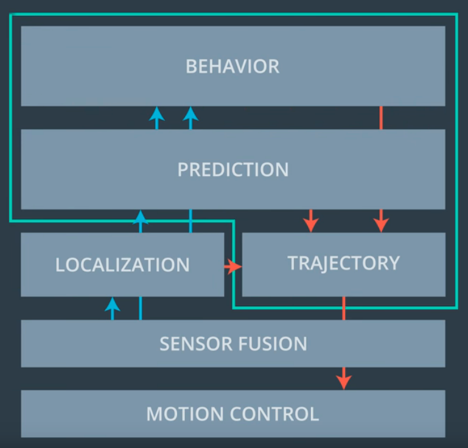

The area in green line consists of all I have to implement in order to make car drive and from the top to bottom also illustrate the amount of time span for example `Behavior` part will take longest time span because it needs to cooperate all data to predict in the future compare to `Motion Control`

Let look at each part

##### Behavior
By implementing, a state of the car `lane` of the car where it is then using prediction of other cars in size of `prev_size * 0.02 sec` and use this data to come up with decision whether 
* (Constant Speed) to keep current limit speed `49.5 mph`
* (Keep Lane) Slow down and keep lane as speed of car in front of
* (Lane Change Left) only no car within a satisfied distant in front and behind on a left lane
* (Lane Change Right) only no car within a satisfied distant in front and behind on a right lane

##### Prediction
//TODO

##### Trajectory
//TODO

## Result

I have run several simulation and here is the result of **the best time with 4.40 miles in 5:34 minutes** without any collisions and no jerk!

If you want to see the full lap please refer to one of attached movies sections below

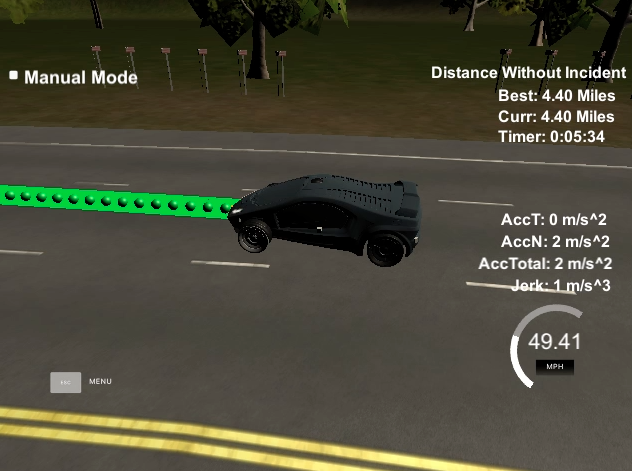

#### Change Lane
sample state changes from keep lane to change lane

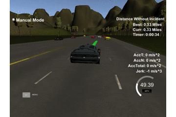
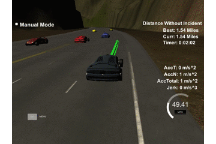
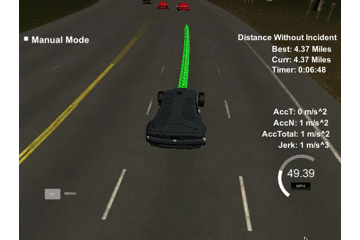
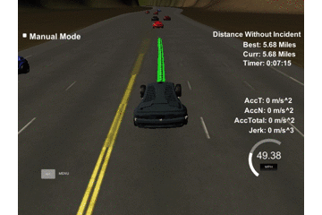

#### Keep Lane
sample state of keeping lane

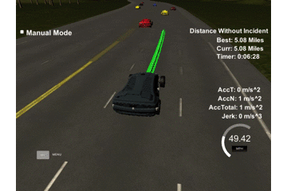
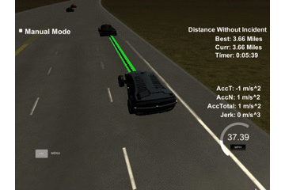
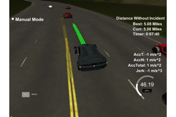
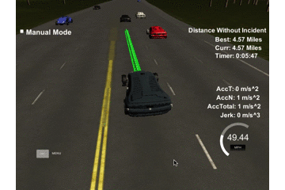

#### Best distances without collisions
From long experiment, I have captures best time without collisions ranging from 4 miles up to 20 miles

Starting from 2 miles

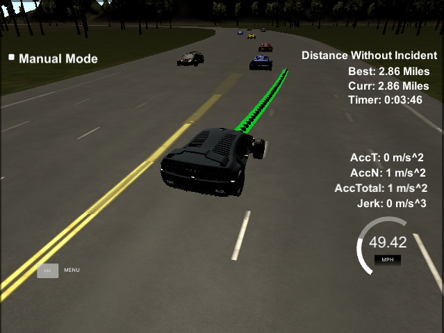

Running from 4 to 8 miles

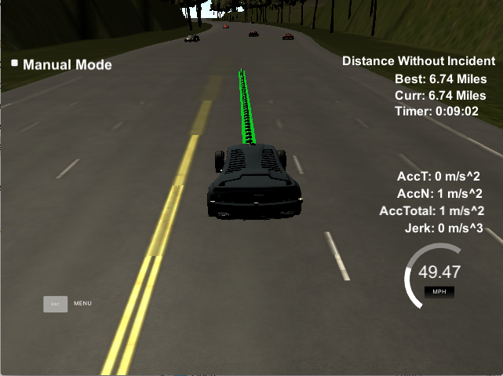
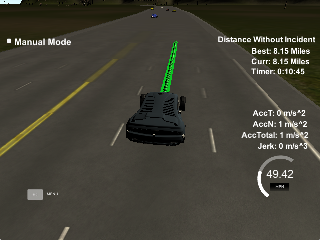
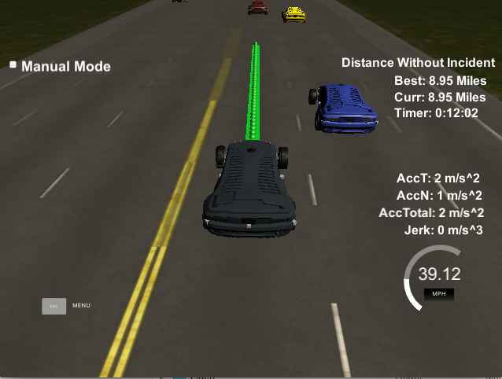

Running from 10 to 20 miles

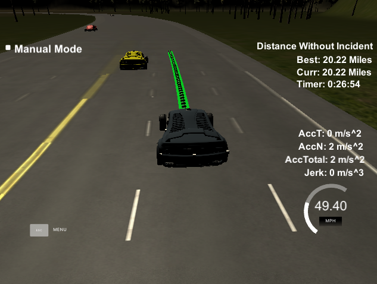

### Recording

[Run Lap 1](asset/first_lap.mp4)

[Run Lap 2](asset/second_lap.mp4)

[Run Lap 3](asset/third_lap.mp4)

## Retrospective

//TODO