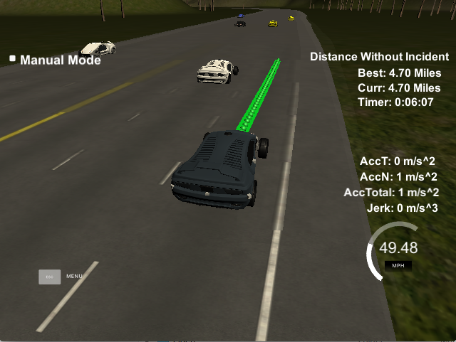
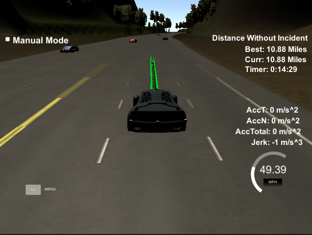
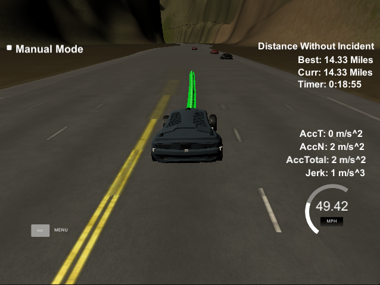
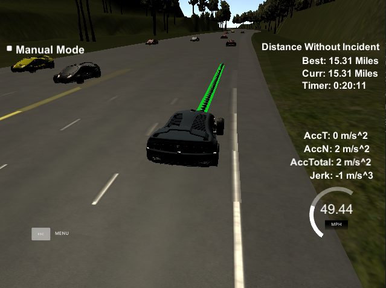

# Path-Planning-Project

Let drive a car not just only smooth but at desired speed as much as possible.

### Goals
In this project, the goal is to safely navigate around a virtual highway with other traffic that is driving +-10 MPH of the 50 MPH speed limit. 

Given the car's localization and sensor fusion data, there is also a sparse map list of waypoints around the highway. The car is running at the 50 MPH speed limit, and passing slower traffic when possible, note that other cars will try to change lanes too. 

The car will avoid hitting other cars at all cost as well as driving inside of the marked road lanes at all times unless going from one lane to another. The car should be able to make one complete loop around the 6946m highway. Since the car is trying to go 50 MPH, it should take a little over 5 minutes to complete 1 loop. Also, the car should not experience total acceleration over 10 m/s^2 and jerk that is greater than 10 m/s^3.

### Simulator.
You can download the Term3 Simulator which contains the Path Planning Project from the [releases tab] (https://github.com/udacity/self-driving-car-sim/releases/tag/T3_v1.2).

## Basic Build Instructions

1. Clone this repo.
2. Make a build directory: `mkdir build && cd build`
3. Compile: `cmake .. && make`
4. Run it: `./path_planning`.

## Overview 

To illustrate how I achieve this project, I would like to point out the overall picture below.


The area in green line consists of all I have to implement in order to make the car drive and from the top to bottom also illustrate the amount of time span for example `Behavior` part will take longest time span because it needs to cooperate all data to predict in the future compare to `Motion Control`

Let look at each part

##### Behavior
By implementing, a state of the car `lane` of the car where it is then using prediction of other cars in size of `prev_size * 0.02 sec` and use this data to come up with the decision whether.

* (Constant Speed) to keep current limit speed `49.5 mph`
* (Keep Lane) Slow down and keep lane as the speed of the car in front of
* (Lane Change Left) only no car within a satisfied distant in front and behind on a left lane
* (Lane Change Right) only no car within a satisfied distant in front and behind on a right lane

##### Prediction
This process is very essential for `Behavior` process above since it will be the input to it. The prediction will be calculated from the sensor fusion data and predict other cars would be in the next horizon time frame.

Code Snippet to find the future coordinate of X and Y then convert to Frenet coordinate `S` and `D` which will be used to help decide the state transition eg. If there is a slower car in front of us, we either `Change Lane` if possible or `Keep Lane`.

```
    double x = sensor_fusion[i][1];
    double y = sensor_fusion[i][2];
    double vx = sensor_fusion[i][3];
    double vy = sensor_fusion[i][4];
    double x_future = x + ((double) prev_size * 0.02 * vx);
    double y_future = y + ((double) prev_size * 0.02 * vy);
    double theta = atan((y_future-y) / (x_future-x));
    vector<double> frenet = getFrenet(x_future, y_future, theta, maps_x, maps_y);
```

##### Trajectory

Once we know exactly what state we're going to be in the future based on `Behavior` and `Prediction` plus `Localization` data. It's time to plan to create a trajectory path as well as minimize jerk (jerk being the change in/derivative of acceleration)

With help of [Spline](http://kluge.in-chemnitz.de/opensource/spline) to help connect the dot smoothly. 

So first we get almost the last point of `previous_path_x` and `previous_path_y` filled in, and addition to that we also add point of x,y of the car in 30, 60 and 90 meters from the Frenet coordinate to fit the `spline` which later we will use it to find plot the trajectory path.

```
    tk::spline s;
    // ptsx and ptsy are vector of point transformed x,y to 0,0 origin and yaw 0 degree
    s.set_points(ptsx, ptsy);
```

At this point, we have left the previous path that hasn't been there or executed in simulator just yet, we use all of them plus points we're going to use `spline` to fill in by `buffer_distance` or 30 meters ahead. 

By this equation

```
    // 0.02 is second car will visit every .02 second 
    // distance is path in meters from current x,y to future x,y
    // number of point ==> N * 0.02 * velocity = distance
    // ref_vel/2.24 ==> ref_vel*0.44704 ==> convert mile/h to meter/sec
    double N = distance/(0.02*ref_vel/2.24);
    double x_point = x_add_on + target_x/N;
    double y_point = s(x_point);

    // x_point and y_point will be appended to the leftover previous path
```

Send data back to our simulator as `next_x` and `next_y` and we're done.

## Result

I have run several simulations and here is the result of **the best time with 4.40 miles in 5:34 minutes** without any collisions and no jerk!

If you want to see the full lap please refer to one of attached movies sections below


#### Change Lane
sample state changes from keep lane to change lane


#### Keep Lane
sample state of keeping lane


#### Best distances without collisions
From long experiment, I have captures best time without collisions ranging from 4 miles up to 20 miles

Starting from 2 miles


Running from 4 to 8 miles




Running from 10 to 20 miles






### Recording

[Run Lap 1](asset/first_lap.mp4)

[Run Lap 2](asset/second_lap.mp4)

[Run Lap 3](asset/third_lap.mp4)

## Retrospective

### Local minimum issue
A local minimum issue where cars block the lane and adjacent lane, the car cannot predict in far beyond its horizon so sometimes it ends up keeping lane without realizing that it can go another path to take over the lane.

### Complexity of State
For this project, the states of the car are not that much to manage but if in the real world situation, we should have another class to handle this finite state to make code cleaner.